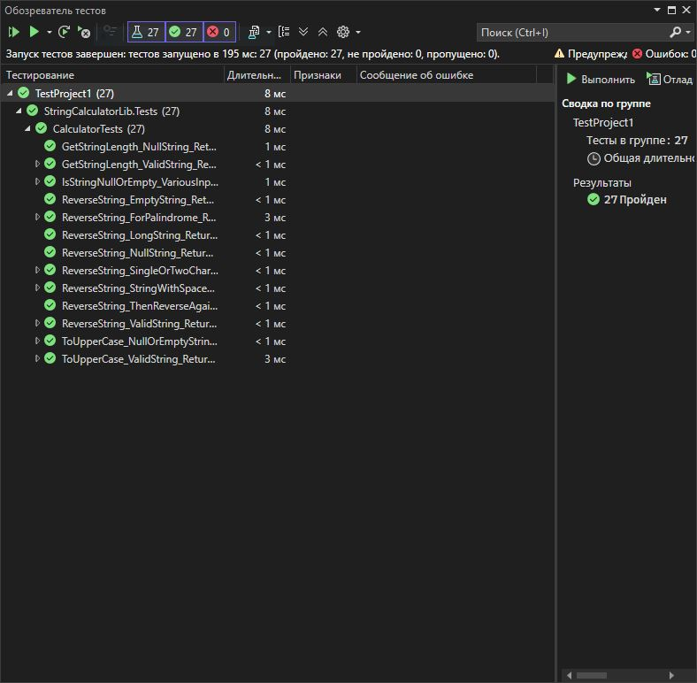

# Практическая работа №4: Написание первых юнит-тестов с xUnit

**Вариант: 3**

**Задание:**
Реализовать в классе `StringUtils` метод `string ReverseString(string input)`, возвращающий перевернутую строку. Написать юнит-тесты для проверки данного метода, охватывая основные и граничные случаи.

## Структура проекта

- `StringCalculatorLib/`: Реализация метода `ReverseString`.
- `StringCalculatorLib.Tests/`: Юнит-тесты на данный метод.
- `images/`: Скриншот результатов тестирования.
- `README.md`: Инструкция и описание.

## Класс `StringUtils`

```csharp
using Xunit;
using StringCalculatorLib;

namespace StringCalculatorLib.Tests
{
    public class CalculatorTests
    {
        private readonly Calculator _calculator;

        public CalculatorTests()
        {
            // Arrange - создаем экземпляр калькулятора для всех тестов
            _calculator = new Calculator();
        }

        // ==================== ТЕСТЫ ДЛЯ ReverseString ====================

        [Theory]
        [InlineData("hello", "olleh")]
        [InlineData("world", "dlrow")]
        [InlineData("12345", "54321")]
        public void ReverseString_ValidString_ReturnsReversedString(string input, string expected)
        {
            // Act
            string result = _calculator.ReverseString(input);

            // Assert
            Assert.Equal(expected, result);
        }

        [Fact]
        public void ReverseString_EmptyString_ReturnsEmptyString()
        {
            // Arrange
            string input = "";
            string expected = "";

            // Act
            string result = _calculator.ReverseString(input);

            // Assert
            Assert.Equal(expected, result);
        }

        [Fact]
        public void ReverseString_NullString_ReturnsNull()
        {
            // Arrange
            string input = null;

            // Act
            string result = _calculator.ReverseString(input);

            // Assert
            Assert.Null(result);
        }

        [Theory]
        [InlineData("a", "a")]
        [InlineData("AB", "BA")]
        public void ReverseString_SingleOrTwoCharacters_ReturnsCorrectResult(string input, string expected)
        {
            // Act
            string result = _calculator.ReverseString(input);

            // Assert
            Assert.Equal(expected, result);
        }

        [Theory]
        [InlineData("hello world", "dlrow olleh")]
        [InlineData("C# .NET", "TEN. #C")]
        [InlineData("тест", "тсет")]
        public void ReverseString_StringWithSpacesAndSpecialChars_ReturnsReversedString(string input, string expected)
        {
            // Act
            string result = _calculator.ReverseString(input);

            // Assert
            Assert.Equal(expected, result);
        }

        [Fact]
        public void ReverseString_LongString_ReturnsReversedString()
        {
            // Arrange
            string input = new string('a', 1000);
            string expected = new string('a', 1000); // Для строки из одинаковых символов перевернутая будет такой же

            // Act
            string result = _calculator.ReverseString(input);

            // Assert
            Assert.Equal(expected, result);
        }

        // ==================== ТЕСТЫ ДЛЯ IsPalindrome ====================

        [Theory]
        [InlineData("hello", 5)]
        [InlineData("", 0)]
        [InlineData("12345", 5)]
        public void GetStringLength_ValidString_ReturnsCorrectLength(string input, int expected)
        {
            // Act
            int result = _calculator.GetStringLength(input);

            // Assert
            Assert.Equal(expected, result);
        }

        [Fact]
        public void GetStringLength_NullString_ReturnsZero()
        {
            // Arrange
            string input = null;
            int expected = 0;

            // Act
            int result = _calculator.GetStringLength(input);

            // Assert
            Assert.Equal(expected, result);
        }

        // ==================== ТЕСТЫ ДЛЯ IsStringNullOrEmpty ====================

        [Theory]
        [InlineData(null, true)]
        [InlineData("", true)]
        [InlineData(" ", false)]
        [InlineData("hello", false)]
        public void IsStringNullOrEmpty_VariousInputs_ReturnsCorrectResult(string input, bool expected)
        {
            // Act
            bool result = _calculator.IsStringNullOrEmpty(input);

            // Assert
            Assert.Equal(expected, result);
        }

        // ==================== ТЕСТЫ ДЛЯ ToUpperCase ====================

        [Theory]
        [InlineData("hello", "HELLO")]
        [InlineData("Hello World", "HELLO WORLD")]
        [InlineData("123", "123")]
        public void ToUpperCase_ValidString_ReturnsUpperCaseString(string input, string expected)
        {
            // Act
            string result = _calculator.ToUpperCase(input);

            // Assert
            Assert.Equal(expected, result);
        }

        [Theory]
        [InlineData(null)]
        [InlineData("")]
        public void ToUpperCase_NullOrEmptyString_ReturnsSameValue(string input)
        {
            // Act
            string result = _calculator.ToUpperCase(input);

            // Assert
            Assert.Equal(input, result);
        }

        // ==================== ДОПОЛНИТЕЛЬНЫЕ ТЕСТЫ ====================

        [Fact]
        public void ReverseString_ThenReverseAgain_ReturnsOriginalString()
        {
            // Arrange
            string original = "Test String";

            // Act
            string reversed = _calculator.ReverseString(original);
            string reversedAgain = _calculator.ReverseString(reversed);

            // Assert
            Assert.Equal(original, reversedAgain);
        }

        [Theory]
        [InlineData("madam")]
        [InlineData("Madam")]
        public void ReverseString_ForPalindrome_ReturnsSameString(string input)
        {
            // Act
            string reversed = _calculator.ReverseString(input);

            // Assert
            // Для палиндрома без учета регистра
            Assert.Equal(input, reversed, ignoreCase: true);
        }
    }
}
```

```csharp
using System;
using System.Linq;

namespace StringCalculatorLib
{
    /// <summary>
    /// Класс Calculator с методами для работы со строками и числами
    /// </summary>
    public class Calculator
    {
        /// <summary>
        /// Возвращает перевернутую строку
        /// </summary>
        /// <param name="input">Исходная строка</param>
        /// <returns>Перевернутая строка</returns>
        public string ReverseString(string input)
        {
            if (input == null)
                return null;

            // Преобразуем строку в массив символов, переворачиваем и создаем новую строку
            return new string(input.Reverse().ToArray());
        }

        /// <summary>
        /// Дополнительный метод: Проверяет, является ли строка палиндромом
        /// </summary>

        

        /// <summary>
        /// Дополнительный метод: Возвращает длину строки
        /// </summary>
        public int GetStringLength(string input)
        {
            return input?.Length ?? 0;
        }

        /// <summary>
        /// Дополнительный метод: Проверяет, пустая ли строка или null
        /// </summary>
        public bool IsStringNullOrEmpty(string input)
        {
            return string.IsNullOrEmpty(input);
        }

        /// <summary>
        /// Дополнительный метод: Конвертирует строку в верхний регистр
        /// </summary>
        public string ToUpperCase(string input)
        {
            return input?.ToUpper() ?? null;
        }

        public bool IsPalindrome(string input)
        {
            throw new NotImplementedException();
        }
    }
}
```
