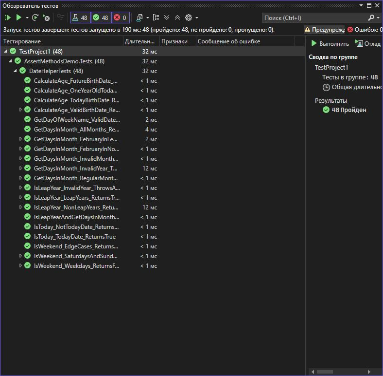

# Практическая работа 5. Использование различных методов Assert в xUnit

**Вариант: 3**

**Задание:**
Класс DateHelper с методами:

bool IsLeapYear(int year)
int GetDaysInMonth(int year, int month)
bool IsWeekend(DateTime date)
## Структура проекта

- `StringCalculatorLib/`: Реализация метода `ReverseString`.
- `StringCalculatorLib.Tests/`: Юнит-тесты на данный метод.
- `images/`: Скриншот результатов тестирования.
- `README.md`: Инструкция и описание.

## Класс `StringUtils`

```csharp
using Xunit;
using AssertMethodsDemo;
using System;
using System.Collections.Generic;

namespace AssertMethodsDemo.Tests
{
    public class DateHelperTests
    {
        private readonly DateHelper _dateHelper;

        public DateHelperTests()
        {
            // Arrange - создаем экземпляр для всех тестов
            _dateHelper = new DateHelper();
        }

        // ==================== ТЕСТЫ ДЛЯ IsLeapYear ====================

        [Theory]
        [InlineData(2020, true)]    // Делится на 4 и не на 100
        [InlineData(2024, true)]    // Делится на 4 и не на 100
        [InlineData(2000, true)]    // Делится на 400
        [InlineData(2400, true)]    // Делится на 400
        public void IsLeapYear_LeapYears_ReturnsTrue(int year, bool expected)
        {
            // Act
            bool result = _dateHelper.IsLeapYear(year);

            // Assert - проверка равенства
            Assert.Equal(expected, result);
            Assert.True(result);
            Assert.NotEqual(false, result);
        }

        [Theory]
        [InlineData(2021, false)]   // Не делится на 4
        [InlineData(2022, false)]   // Не делится на 4
        [InlineData(1900, false)]   // Делится на 100, но не на 400
        [InlineData(2100, false)]   // Делится на 100, но не на 400
        public void IsLeapYear_NonLeapYears_ReturnsFalse(int year, bool expected)
        {
            // Act
            bool result = _dateHelper.IsLeapYear(year);

            // Assert - проверка условий
            Assert.Equal(expected, result);
            Assert.False(result);
            Assert.NotEqual(true, result);
        }

        [Theory]
        [InlineData(0)]
        [InlineData(-1)]
        [InlineData(10000)]
        [InlineData(10001)]
        public void IsLeapYear_InvalidYear_ThrowsArgumentOutOfRangeException(int year)
        {
            // Act & Assert - проверка исключений
            var exception = Assert.Throws<ArgumentOutOfRangeException>(() =>
                _dateHelper.IsLeapYear(year));

            Assert.NotNull(exception);
            Assert.Contains("Year must be between", exception.Message);
            Assert.Contains("year", exception.ParamName, StringComparison.OrdinalIgnoreCase);
        }

        // ==================== ТЕСТЫ ДЛЯ GetDaysInMonth ====================

        [Theory]
        [InlineData(2023, 1, 31)]   // Январь
        [InlineData(2023, 3, 31)]   // Март
        [InlineData(2023, 4, 30)]   // Апрель
        [InlineData(2023, 6, 30)]   // Июнь
        public void GetDaysInMonth_RegularMonths_ReturnsCorrectDays(int year, int month, int expected)
        {
            // Act
            int result = _dateHelper.GetDaysInMonth(year, month);

            // Assert - проверка равенства
            Assert.Equal(expected, result);
            Assert.True(result >= 28 && result <= 31);
            Assert.IsType<int>(result);
        }

        [Theory]
        [InlineData(2020, 2, 29)]   // Февраль високосного года
        [InlineData(2024, 2, 29)]   // Февраль високосного года
        [InlineData(2000, 2, 29)]   // Февраль високосного года
        public void GetDaysInMonth_FebruaryInLeapYear_Returns29Days(int year, int month, int expected)
        {
            // Act
            int result = _dateHelper.GetDaysInMonth(year, month);

            // Assert
            Assert.Equal(expected, result);
            Assert.Equal(29, result);
            Assert.NotEqual(28, result);
        }

        [Theory]
        [InlineData(2023, 2, 28)]   // Февраль обычного года
        [InlineData(2021, 2, 28)]   // Февраль обычного года
        [InlineData(1900, 2, 28)]   // Февраль обычного года (не високосный)
        public void GetDaysInMonth_FebruaryInNonLeapYear_Returns28Days(int year, int month, int expected)
        {
            // Act
            int result = _dateHelper.GetDaysInMonth(year, month);

            // Assert
            Assert.Equal(expected, result);
            Assert.Equal(28, result);
            Assert.NotEqual(29, result);
        }

        [Theory]
        [InlineData(2023, 0)]
        [InlineData(2023, 13)]
        [InlineData(2023, -1)]
        public void GetDaysInMonth_InvalidMonth_ThrowsException(int year, int month)
        {
            // Act & Assert
            var exception = Assert.Throws<ArgumentOutOfRangeException>(() =>
                _dateHelper.GetDaysInMonth(year, month));

            Assert.NotNull(exception);
            Assert.Contains("Month must be between", exception.Message);
        }

        [Theory]
        [InlineData(0, 1)]
        [InlineData(-1, 1)]
        [InlineData(10000, 1)]
        public void GetDaysInMonth_InvalidYear_ThrowsException(int year, int month)
        {
            // Act & Assert
            var exception = Assert.Throws<ArgumentOutOfRangeException>(() =>
                _dateHelper.GetDaysInMonth(year, month));

            Assert.NotNull(exception);
            Assert.Contains("Year must be between", exception.Message);
        }

        // ==================== ТЕСТЫ ДЛЯ IsWeekend ====================

        [Theory]
        [InlineData(2023, 9, 2)]    // Суббота
        [InlineData(2023, 9, 3)]    // Воскресенье
        [InlineData(2023, 12, 30)]  // Суббота
        [InlineData(2023, 12, 31)]  // Воскресенье
        public void IsWeekend_SaturdaysAndSundays_ReturnsTrue(int year, int month, int day)
        {
            // Arrange
            var date = new DateTime(year, month, day);

            // Act
            bool result = _dateHelper.IsWeekend(date);

            // Assert
            Assert.True(result);
            Assert.Equal(true, result);
            Assert.NotEqual(false, result);
        }

        [Theory]
        [InlineData(2023, 9, 4)]    // Понедельник
        [InlineData(2023, 9, 5)]    // Вторник
        [InlineData(2023, 9, 6)]    // Среда
        [InlineData(2023, 9, 7)]    // Четверг
        [InlineData(2023, 9, 8)]    // Пятница
        public void IsWeekend_Weekdays_ReturnsFalse(int year, int month, int day)
        {
            // Arrange
            var date = new DateTime(year, month, day);

            // Act
            bool result = _dateHelper.IsWeekend(date);

            // Assert
            Assert.False(result);
            Assert.Equal(false, result);
            Assert.NotEqual(true, result);
        }

        [Fact]
        public void IsWeekend_EdgeCases_ReturnsCorrectResults()
        {
            // Arrange
            var saturday = new DateTime(2023, 9, 2);
            var sunday = new DateTime(2023, 9, 3);
            var monday = new DateTime(2023, 9, 4);

            // Act
            bool isSaturdayWeekend = _dateHelper.IsWeekend(saturday);
            bool isSundayWeekend = _dateHelper.IsWeekend(sunday);
            bool isMondayWeekend = _dateHelper.IsWeekend(monday);

            // Assert - проверка нескольких условий
            Assert.True(isSaturdayWeekend);
            Assert.True(isSundayWeekend);
            Assert.False(isMondayWeekend);

            // Проверка, что суббота и воскресенье дают одинаковый результат
            Assert.Equal(isSaturdayWeekend, isSundayWeekend);
            Assert.NotEqual(isSaturdayWeekend, isMondayWeekend);
        }

        // ==================== ДОПОЛНИТЕЛЬНЫЕ ТЕСТЫ ====================

        [Fact]
        public void GetDayOfWeekName_ValidDate_ReturnsCorrectName()
        {
            // Arrange
            var monday = new DateTime(2023, 9, 4);
            var sunday = new DateTime(2023, 9, 3);

            // Act
            string mondayName = _dateHelper.GetDayOfWeekName(monday);
            string sundayName = _dateHelper.GetDayOfWeekName(sunday);

            // Assert - проверка строк
            Assert.NotNull(mondayName);
            Assert.NotNull(sundayName);
            Assert.Equal("Monday", mondayName);
            Assert.Equal("Sunday", sundayName);
            Assert.NotEqual(mondayName, sundayName);
            Assert.Contains("day", mondayName);
            Assert.Contains("day", sundayName);
        }

        [Fact]
        public void IsToday_TodayDate_ReturnsTrue()
        {
            // Arrange
            var today = DateTime.Today;

            // Act
            bool result = _dateHelper.IsToday(today);

            // Assert
            Assert.True(result);
        }

        [Fact]
        public void IsToday_NotTodayDate_ReturnsFalse()
        {
            // Arrange
            var yesterday = DateTime.Today.AddDays(-1);
            var tomorrow = DateTime.Today.AddDays(1);

            // Act
            bool yesterdayResult = _dateHelper.IsToday(yesterday);
            bool tomorrowResult = _dateHelper.IsToday(tomorrow);

            // Assert
            Assert.False(yesterdayResult);
            Assert.False(tomorrowResult);
        }

        [Theory]
        [InlineData(2000, 1, 1)]    // 1 января 2000
        [InlineData(1990, 6, 15)]   // 15 июня 1990
        public void CalculateAge_ValidBirthDate_ReturnsCorrectAge(int year, int month, int day)
        {
            // Arrange
            var birthDate = new DateTime(year, month, day);
            var today = DateTime.Today;
            int expectedAge = today.Year - birthDate.Year;

            // Если день рождения еще не наступил, вычитаем 1
            if (birthDate.Date > today.AddYears(-expectedAge))
                expectedAge--;

            // Act
            int result = _dateHelper.CalculateAge(birthDate);

            // Assert
            Assert.Equal(expectedAge, result);
            Assert.True(result >= 0);
            Assert.IsType<int>(result);
        }

        [Fact]
        public void CalculateAge_FutureBirthDate_ThrowsException()
        {
            // Arrange
            var futureDate = DateTime.Today.AddYears(1);

            // Act & Assert
            var exception = Assert.Throws<ArgumentException>(() =>
                _dateHelper.CalculateAge(futureDate));

            Assert.NotNull(exception);
            Assert.Contains("cannot be in the future", exception.Message);
        }

        [Fact]
        public void CalculateAge_TodayBirthDate_ReturnsZero()
        {
            // Arrange
            var today = DateTime.Today;

            // Act
            int result = _dateHelper.CalculateAge(today);

            // Assert
            Assert.Equal(0, result);
        }

        [Fact]
        public void CalculateAge_OneYearOldToday_ReturnsOne()
        {
            // Arrange
            var oneYearAgo = DateTime.Today.AddYears(-1);

            // Act
            int result = _dateHelper.CalculateAge(oneYearAgo);

            // Assert
            Assert.Equal(1, result);
        }

        // ==================== ИНТЕГРАЦИОННЫЕ ТЕСТЫ ====================

        [Fact]
        public void IsLeapYearAndGetDaysInMonth_ConsistentResults()
        {
            // Arrange
            List<int> leapYears = new List<int> { 2020, 2024, 2000, 2400 };
            List<int> nonLeapYears = new List<int> { 2021, 2022, 1900, 2100 };

            // Act & Assert для високосных годов
            foreach (int year in leapYears)
            {
                bool isLeap = _dateHelper.IsLeapYear(year);
                int febDays = _dateHelper.GetDaysInMonth(year, 2);

                Assert.True(isLeap);
                Assert.Equal(29, febDays);
            }

            // Act & Assert для невисокосных годов
            foreach (int year in nonLeapYears)
            {
                bool isLeap = _dateHelper.IsLeapYear(year);
                int febDays = _dateHelper.GetDaysInMonth(year, 2);

                Assert.False(isLeap);
                Assert.Equal(28, febDays);
            }
        }

        [Fact]
        public void GetDaysInMonth_AllMonths_ReturnsValidRange()
        {
            // Arrange
            int year = 2023;
            List<int> results = new List<int>();

            // Act - получаем дни для всех месяцев
            for (int month = 1; month <= 12; month++)
            {
                int days = _dateHelper.GetDaysInMonth(year, month);
                results.Add(days);
            }

            // Assert - проверка коллекции
            Assert.NotNull(results);
            Assert.NotEmpty(results);
            Assert.Equal(12, results.Count);
            Assert.All(results, days => Assert.InRange(days, 28, 31));
            Assert.Contains(31, results);  // Должны быть месяцы с 31 днем
            Assert.Contains(30, results);  // Должны быть месяцы с 30 днями
            Assert.Contains(28, results);  // Февраль имеет 28 дней
        }
    }
}
```

```csharp
using System;

namespace AssertMethodsDemo
{
    /// <summary>
    /// Класс для работы с датами и временем
    /// </summary>
    public class DateHelper
    {
        /// <summary>
        /// Проверяет, является ли год високосным
        /// </summary>
        /// <param name="year">Год для проверки</param>
        /// <returns>True если год високосный, иначе False</returns>
        public bool IsLeapYear(int year)
        {
            if (year < 1 || year > 9999)
                throw new ArgumentOutOfRangeException(nameof(year), "Year must be between 1 and 9999");

            // Правило високосного года:
            // Год високосный, если он делится на 4, но не делится на 100,
            // либо делится на 400
            return (year % 4 == 0) && (year % 100 != 0) || (year % 400 == 0);
        }

        /// <summary>
        /// Возвращает количество дней в месяце с учетом года
        /// </summary>
        /// <param name="year">Год</param>
        /// <param name="month">Месяц (1-12)</param>
        /// <returns>Количество дней в месяце</returns>
        public int GetDaysInMonth(int year, int month)
        {
            if (year < 1 || year > 9999)
                throw new ArgumentOutOfRangeException(nameof(year), "Year must be between 1 and 9999");

            if (month < 1 || month > 12)
                throw new ArgumentOutOfRangeException(nameof(month), "Month must be between 1 and 12");

            // Массив дней в месяцах для обычного года
            int[] daysInMonth = { 31, 28, 31, 30, 31, 30, 31, 31, 30, 31, 30, 31 };

            // Для февраля проверяем високосный год
            if (month == 2 && IsLeapYear(year))
                return 29;

            return daysInMonth[month - 1];
        }

        /// <summary>
        /// Проверяет, является ли дата выходным днем
        /// </summary>
        /// <param name="date">Дата для проверки</param>
        /// <returns>True если дата - суббота или воскресенье, иначе False</returns>
        public bool IsWeekend(DateTime date)
        {
            // DayOfWeek.Sunday = 0, DayOfWeek.Saturday = 6
            return date.DayOfWeek == DayOfWeek.Saturday ||
                   date.DayOfWeek == DayOfWeek.Sunday;
        }

        /// <summary>
        /// Дополнительный метод: Получает название дня недели
        /// </summary>
        public string GetDayOfWeekName(DateTime date)
        {
            return date.DayOfWeek.ToString();
        }

        /// <summary>
        /// Дополнительный метод: Проверяет, является ли дата сегодняшним днем
        /// </summary>
        public bool IsToday(DateTime date)
        {
            return date.Date == DateTime.Today;
        }

        /// <summary>
        /// Дополнительный метод: Вычисляет возраст по дате рождения
        /// </summary>
        public int CalculateAge(DateTime birthDate)
        {
            if (birthDate > DateTime.Today)
                throw new ArgumentException("Birth date cannot be in the future", nameof(birthDate));

            int age = DateTime.Today.Year - birthDate.Year;

            // Если день рождения еще не наступил в этом году, вычитаем 1 год
            if (birthDate.Date > DateTime.Today.AddYears(-age))
                age--;

            return age;
        }
    }
}
```
