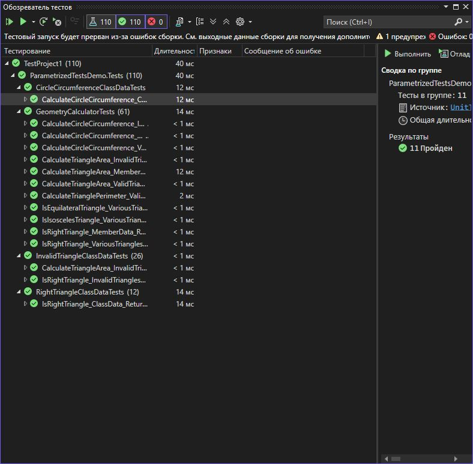

Практическая работа 6. Написание параметризированных тестов в xUnit
**Вариант: 3**

**Задание:**
Класс GeometryCalculator

double CalculateTriangleArea(double a, double b, double c)
bool IsRightTriangle(double a, double b, double c)
double CalculateCircleCircumference(double radius)
## Структура проекта

- `StringCalculatorLib/`: Реализация метода `ReverseString`.
- `StringCalculatorLib.Tests/`: Юнит-тесты на данный метод.
- `images/`: Скриншот результатов тестирования.
- `README.md`: Инструкция и описание.

## Класс `StringUtils`

```csharp
using Xunit;
using ParametrizedTestsDemo;
using System;
using System.Collections.Generic;

namespace ParametrizedTestsDemo.Tests
{
    public class GeometryCalculatorTests
    {
        private readonly GeometryCalculator _calculator;

        public GeometryCalculatorTests()
        {
            _calculator = new GeometryCalculator();
        }

        // ==================== ТЕСТЫ С ИСПОЛЬЗОВАНИЕМ [InlineData] ====================

        [Theory]
        [InlineData(3, 4, 5, 6)]               // Прямоугольный треугольник
        [InlineData(5, 5, 6, 12)]              // Равнобедренный треугольник
        [InlineData(6, 8, 10, 24)]             // Другой прямоугольный треугольник
        [InlineData(7, 8, 9, 26.832815729997)] // Остроугольный треугольник
        public void CalculateTriangleArea_ValidTriangles_ReturnsCorrectArea(double a, double b, double c, double expected)
        {
            // Act
            double result = _calculator.CalculateTriangleArea(a, b, c);

            // Assert
            Assert.Equal(expected, result, 10); // Точность до 10 знаков
        }

        [Theory]
        [InlineData(1, 0, 1)]          // Нулевая сторона
        [InlineData(-1, 2, 2)]         // Отрицательная сторона
        [InlineData(1, 1, 3)]          // Несуществующий треугольник (1+1=2 < 3)
        [InlineData(1, 2, 1)]          // Вырожденный треугольник
        public void CalculateTriangleArea_InvalidTriangles_ThrowsException(double a, double b, double c)
        {
            // Act & Assert
            Assert.Throws<ArgumentException>(() => _calculator.CalculateTriangleArea(a, b, c));
        }

        [Theory]
        [InlineData(3, 4, 5, true)]    // Классический прямоугольный треугольник
        [InlineData(5, 12, 13, true)]  // Еще один прямоугольный треугольник
        [InlineData(6, 8, 10, true)]   // Увеличенный 3-4-5 треугольник
        [InlineData(2, 3, 4, false)]   // Не прямоугольный треугольник
        [InlineData(5, 5, 5, false)]   // Равносторонний треугольник (не прямоугольный)
        public void IsRightTriangle_VariousTriangles_ReturnsCorrectResult(double a, double b, double c, bool expected)
        {
            // Act
            bool result = _calculator.IsRightTriangle(a, b, c);

            // Assert
            Assert.Equal(expected, result);
        }

        [Theory]
        [InlineData(1.0, 2 * Math.PI)]         // Радиус 1
        [InlineData(2.0, 4 * Math.PI)]         // Радиус 2
        [InlineData(5.0, 10 * Math.PI)]        // Радиус 5
        [InlineData(10.0, 20 * Math.PI)]       // Радиус 10
        [InlineData(0.5, Math.PI)]             // Радиус 0.5
        public void CalculateCircleCircumference_ValidRadius_ReturnsCorrectValue(double radius, double expected)
        {
            // Act
            double result = _calculator.CalculateCircleCircumference(radius);

            // Assert
            Assert.Equal(expected, result, 10);
        }

        [Theory]
        [InlineData(0)]     // Нулевой радиус
        [InlineData(-1)]    // Отрицательный радиус
        [InlineData(-5.5)]  // Отрицательный дробный радиус
        public void CalculateCircleCircumference_InvalidRadius_ThrowsException(double radius)
        {
            // Act & Assert
            Assert.Throws<ArgumentException>(() => _calculator.CalculateCircleCircumference(radius));
        }

        // ==================== ТЕСТЫ С ИСПОЛЬЗОВАНИЕМ [MemberData] ====================

        public static IEnumerable<object[]> TriangleAreaTestData
        {
            get
            {
                // Правильные треугольники
                yield return new object[] { 3.0, 4.0, 5.0, 6.0 };
                yield return new object[] { 13.0, 14.0, 15.0, 84.0 };
                yield return new object[] { 7.0, 8.0, 9.0, 26.832815729997478 };
                yield return new object[] { 11.0, 12.0, 13.0, 61.48170459575759 };

                // Равносторонние треугольники
                yield return new object[] { 1.0, 1.0, 1.0, 0.4330127018922193 };
                yield return new object[] { 2.0, 2.0, 2.0, 1.7320508075688772 };
                yield return new object[] { 5.0, 5.0, 5.0, 10.825317547305483 };

                // Практические примеры
                yield return new object[] { 8.0, 15.0, 17.0, 60.0 };
                yield return new object[] { 9.0, 12.0, 15.0, 54.0 };
            }
        }

        [Theory]
        [MemberData(nameof(TriangleAreaTestData))]
        public void CalculateTriangleArea_MemberData_ReturnsCorrectArea(double a, double b, double c, double expected)
        {
            // Act
            double result = _calculator.CalculateTriangleArea(a, b, c);

            // Assert
            Assert.Equal(expected, result, 10);
        }

        public static IEnumerable<object[]> RightTriangleTestData
        {
            get
            {
                // Пифагоровы тройки
                yield return new object[] { 3.0, 4.0, 5.0, true };
                yield return new object[] { 5.0, 12.0, 13.0, true };
                yield return new object[] { 8.0, 15.0, 17.0, true };
                yield return new object[] { 7.0, 24.0, 25.0, true };
                yield return new object[] { 20.0, 21.0, 29.0, true };

                // Не прямоугольные треугольники
                yield return new object[] { 2.0, 3.0, 4.0, false };
                yield return new object[] { 5.0, 5.0, 8.0, false };
                yield return new object[] { 6.0, 7.0, 8.0, false };

                // Пограничные случаи (почти прямоугольные)
                yield return new object[] { 3.0, 4.0, 5.0000001, false };
                yield return new object[] { 3.0, 4.0, 4.9999999, false };
            }
        }

```

```csharp
using System;

namespace ParametrizedTestsDemo
{
    /// <summary>
    /// Класс для геометрических расчетов
    /// </summary>
    public class GeometryCalculator
    {
        /// <summary>
        /// Вычисляет площадь треугольника по трем сторонам (формула Герона)
        /// </summary>
        /// <param name="a">Сторона A</param>
        /// <param name="b">Сторона B</param>
        /// <param name="c">Сторона C</param>
        /// <returns>Площадь треугольника</returns>
        public double CalculateTriangleArea(double a, double b, double c)
        {
            // Проверка на валидность треугольника
            if (a <= 0 || b <= 0 || c <= 0)
                throw new ArgumentException("Все стороны треугольника должны быть положительными");

            if (a + b <= c || a + c <= b || b + c <= a)
                throw new ArgumentException("Треугольник с такими сторонами не существует");

            // Формула Герона
            double p = (a + b + c) / 2;
            double area = Math.Sqrt(p * (p - a) * (p - b) * (p - c));

            // Проверка на вырожденность (площадь близка к нулю)
            if (area < 1e-10)
                throw new ArgumentException("Треугольник вырожденный");

            return area;
        }

        /// <summary>
        /// Проверяет, является ли треугольник прямоугольным
        /// </summary>
        public bool IsRightTriangle(double a, double b, double c)
        {
            // Проверка на валидность треугольника
            if (a <= 0 || b <= 0 || c <= 0)
                throw new ArgumentException("Все стороны треугольника должны быть положительными");

            if (a + b <= c || a + c <= b || b + c <= a)
                throw new ArgumentException("Треугольник с такими сторонами не существует");

            // Сортируем стороны для удобства проверки
            double[] sides = { a, b, c };
            Array.Sort(sides);

            // Проверяем теорему Пифагора с допуском на погрешность вычислений
            double tolerance = 1e-10;
            double hypotenuseSquared = Math.Pow(sides[2], 2);
            double legsSquaredSum = Math.Pow(sides[0], 2) + Math.Pow(sides[1], 2);

            return Math.Abs(hypotenuseSquared - legsSquaredSum) < tolerance;
        }

        /// <summary>
        /// Вычисляет длину окружности
        /// </summary>
        /// <param name="radius">Радиус окружности</param>
        /// <returns>Длина окружности</returns>
        public double CalculateCircleCircumference(double radius)
        {
            if (radius <= 0)
                throw new ArgumentException("Радиус должен быть положительным");

            return 2 * Math.PI * radius;
        }

        /// <summary>
        /// Дополнительный метод: Вычисляет площадь круга
        /// </summary>
        public double CalculateCircleArea(double radius)
        {
            if (radius <= 0)
                throw new ArgumentException("Радиус должен быть положительным");

            return Math.PI * radius * radius;
        }

        /// <summary>
        /// Дополнительный метод: Проверяет, является ли треугольник равносторонним
        /// </summary>
        public bool IsEquilateralTriangle(double a, double b, double c)
        {
            if (a <= 0 || b <= 0 || c <= 0)
                return false;

            double tolerance = 1e-10;
            return Math.Abs(a - b) < tolerance && Math.Abs(b - c) < tolerance;
        }

        /// <summary>
        /// Дополнительный метод: Проверяет, является ли треугольник равнобедренным
        /// </summary>
        public bool IsIsoscelesTriangle(double a, double b, double c)
        {
            if (a <= 0 || b <= 0 || c <= 0)
                return false;

            if (a + b <= c || a + c <= b || b + c <= a)
                return false;

            double tolerance = 1e-10;
            return Math.Abs(a - b) < tolerance || Math.Abs(a - c) < tolerance || Math.Abs(b - c) < tolerance;
        }

        /// <summary>
        /// Дополнительный метод: Находит периметр треугольника
        /// </summary>
        public double CalculateTrianglePerimeter(double a, double b, double c)
        {
            if (a <= 0 || b <= 0 || c <= 0)
                throw new ArgumentException("Все стороны треугольника должны быть положительными");

            if (a + b <= c || a + c <= b || b + c <= a)
                throw new ArgumentException("Треугольник с такими сторонами не существует");

            return a + b + c;
        }
    }
}
```
