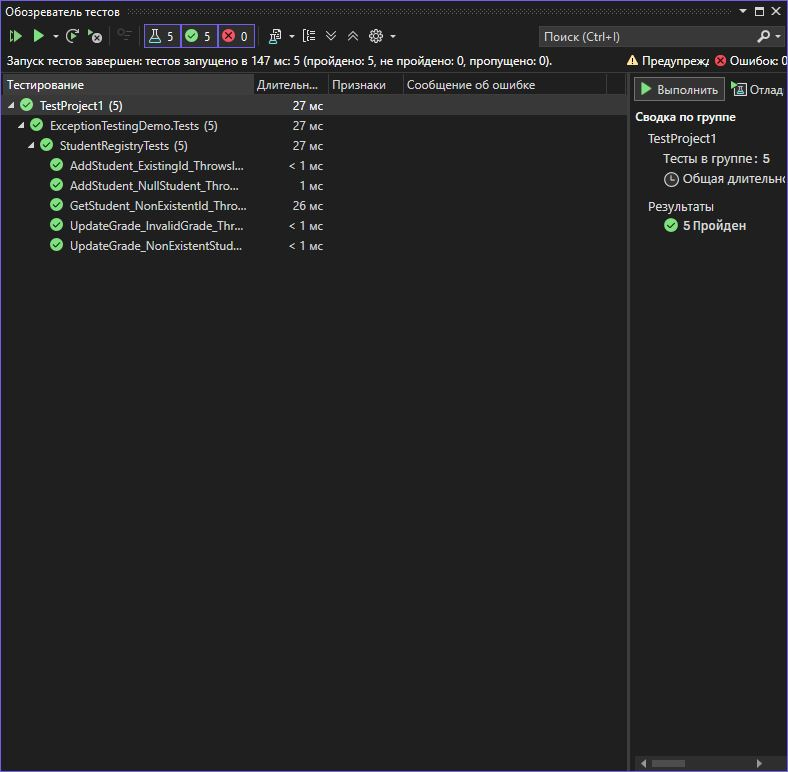

# Практическая работа 7. Тестирование исключений с помощью Assert.Throws в xUnit
**Вариант: 3**

**Задание:**
Вариант 3: Класс StudentRegistry с методами:

void AddStudent(Student student)
Student GetStudent(int id)
void UpdateGrade(int studentId, string subject, int grade)
## Структура проекта

- `StringCalculatorLib/`: Реализация метода `ReverseString`.
- `StringCalculatorLib.Tests/`: Юнит-тесты на данный метод.
- `images/`: Скриншот результатов тестирования.
- `README.md`: Инструкция и описание.

## Класс `StringUtils`

```csharp
using Xunit;

namespace ExceptionTestingDemo.Tests
{
    public class StudentRegistryTests
    {
        [Fact]
        public void AddStudent_ExistingId_ThrowsInvalidOperationException()
        {
            var registry = new StudentRegistry();
            var student = new Student(1, "John");

            registry.AddStudent(student);

            var duplicateStudent = new Student(1, "Jane");

            var ex = Assert.Throws<InvalidOperationException>(() => registry.AddStudent(duplicateStudent));
            Assert.Contains("already exists", ex.Message);
        }

        [Fact]
        public void GetStudent_NonExistentId_ThrowsStudentNotFoundException()
        {
            var registry = new StudentRegistry();

            var ex = Assert.Throws<StudentNotFoundException>(() => registry.GetStudent(999));
            Assert.Equal(999, ex.StudentId);
            Assert.Contains("not found", ex.Message);
        }

        [Fact]
        public void UpdateGrade_NonExistentStudent_ThrowsStudentNotFoundException()
        {
            var registry = new StudentRegistry();

            var ex = Assert.Throws<StudentNotFoundException>(() => registry.UpdateGrade(123, "Math", 85));
            Assert.Equal(123, ex.StudentId);
        }

        [Fact]
        public void UpdateGrade_InvalidGrade_ThrowsArgumentOutOfRangeException()
        {
            var registry = new StudentRegistry();
            var student = new Student(1, "John");
            registry.AddStudent(student);

            var ex = Assert.Throws<ArgumentOutOfRangeException>(() => registry.UpdateGrade(1, "Math", -5));
            Assert.Equal("grade", ex.ParamName);
        }

        [Fact]
        public void AddStudent_NullStudent_ThrowsArgumentNullException()
        {
            var registry = new StudentRegistry();
            Assert.Throws<ArgumentNullException>(() => registry.AddStudent(null));
        }
    }
}
```

```csharp
public class StudentRegistry
{
    private readonly Dictionary<int, Student> _students = new Dictionary<int, Student>();

    public void AddStudent(Student student)
    {
        if (student == null)
            throw new ArgumentNullException(nameof(student));
        if (_students.ContainsKey(student.Id))
            throw new InvalidOperationException($"Student with ID {student.Id} already exists.");
        _students.Add(student.Id, student);
    }

    public Student GetStudent(int id)
    {
        if (!_students.TryGetValue(id, out var student))
            throw new StudentNotFoundException(id);
        return student;
    }

    public void UpdateGrade(int studentId, string subject, int grade)
    {
        if (string.IsNullOrWhiteSpace(subject))
            throw new ArgumentException("Subject cannot be null or empty.", nameof(subject));
        if (grade < 0 || grade > 100)
            throw new ArgumentOutOfRangeException(nameof(grade), "Grade must be between 0 and 100.");
        var student = GetStudent(studentId);
        student.Grades[subject] = grade;
    }
}
public class StudentNotFoundException : Exception
{
    public int StudentId { get; }

    public StudentNotFoundException(int studentId)
        : base($"Student with ID {studentId} was not found.")
    {
        StudentId = studentId;
    }
}
public class Student
{
    public int Id { get; }
    public string Name { get; set; }
    public Dictionary<string, int> Grades { get; }

    public Student(int id, string name)
    {
        Id = id;
        Name = name;
        Grades = new Dictionary<string, int>();
    }
}
```
