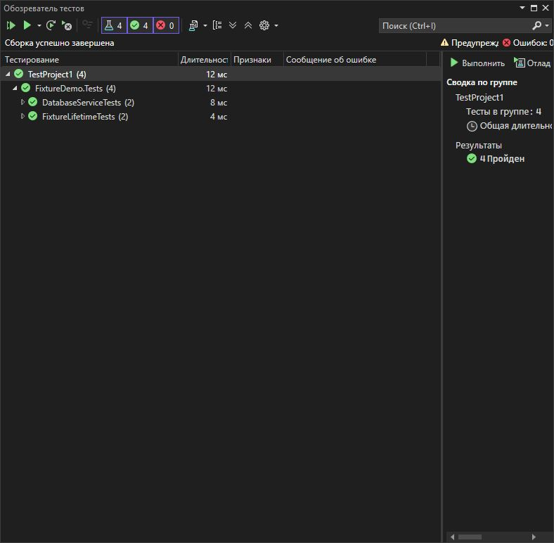

# Практическая работа 8. Организация тестов в группы с помощью Trait и Category
**Вариант: 3**

**Задание:**
Вариант 3: Система аутентификации (AuthSystem)

Тесты для регистрации, логина, смены пароля
Стабильность: Stable, Flaky
Категории: Unit, Integration, Security
## Структура проекта

- `StringCalculatorLib/`: Реализация метода `ReverseString`.
- `StringCalculatorLib.Tests/`: Юнит-тесты на данный метод.
- `images/`: Скриншот результатов тестирования.
- `README.md`: Инструкция и описание.

## Класс `StringUtils`

```csharp
using Xunit;
using FixtureDemo;

namespace FixtureDemo.Tests
{
    // 1. Class Fixture с IDisposable
    public class DatabaseFixture : IDisposable
    {
        public DatabaseService Database { get; }
        public int InitializationTime { get; }

        public DatabaseFixture()
        {
            Database = new DatabaseService();
            InitializationTime = Environment.TickCount;
            Console.WriteLine($"DatabaseFixture created at {InitializationTime}");
        }

        public void Dispose()
        {
            Database?.Dispose();
            Console.WriteLine($"DatabaseFixture disposed after {Environment.TickCount - InitializationTime}ms");
        }
    }

    // 2. Class Fixture с IAsyncLifetime
    public class CacheFixture : IAsyncLifetime
    {
        public CacheService Cache { get; private set; }
        public bool IsInitialized { get; private set; }

        public async Task InitializeAsync()
        {
            Cache = new CacheService();
            await Cache.InitializeAsync();
            IsInitialized = true;
            Console.WriteLine("CacheFixture initialized asynchronously");
        }

        public async Task DisposeAsync()
        {
            if (Cache != null)
            {
                await Cache.DisposeAsync();
            }
            Console.WriteLine("CacheFixture disposed asynchronously");
        }
    }

    // 3. Collection Fixture
    

    // 4. Collection Fixture с асинхронной инициализацией
    public class FileSystemFixture : IAsyncLifetime
    {
        public string TestDirectory { get; private set; }
        public int FilesCreated { get; private set; }

        public async Task InitializeAsync()
        {
            TestDirectory = Path.Combine(Path.GetTempPath(), $"Test_{Guid.NewGuid()}");
            Directory.CreateDirectory(TestDirectory);
            FilesCreated = 0;

            // Имитация асинхронной настройки
            await Task.Delay(100);
            Console.WriteLine($"FileSystemFixture initialized with directory: {TestDirectory}");
        }

```

```csharp
namespace FixtureDemo
{
    public class DatabaseService : IDisposable
    {
        private bool _disposed = false;
        public List<string> ExecutedQueries { get; } = new();
        public int ConnectionCount { get; private set; }

        public DatabaseService()
        {
            // Имитация установки соединения с БД
            ConnectionCount++;
            Console.WriteLine("Database connection opened");
        }

        


        public void Dispose()
        {
            if (!_disposed)
            {
                ConnectionCount--;
                Console.WriteLine("Database connection closed");
                _disposed = true;
            }
        }
    }

    public class FileProcessor : IAsyncDisposable
    {
        private string _tempFilePath;
        public int ProcessedFiles { get; private set; }

        public FileProcessor()
        {
            _tempFilePath = Path.GetTempFileName();
            Console.WriteLine($"Temp file created: {_tempFilePath}");
        }

        public async Task WriteToFileAsync(string content)
        {
            await File.WriteAllTextAsync(_tempFilePath, content);
            ProcessedFiles++;
        }

        public async Task<string> ReadFromFileAsync()
        {
            return await File.ReadAllTextAsync(_tempFilePath);
        }

```
