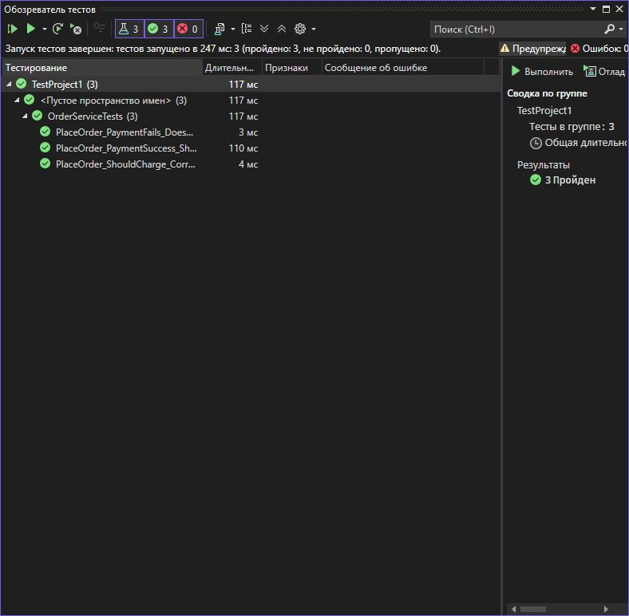

# Практическая работа №10  
## Изоляция класса тестирования с помощью Moq  

**Вариант:** 3 
**Тема:** Тестирование `OrderService` — изоляция зависимостей `IOrderRepository` и `IPaymentGateway`.

### 📄 Задание
- Реализовать класс `OrderService`, который:
  - принимает заказ
  - взаимодействует с `IPaymentGateway` для списания суммы
  - сохраняет заказ через `IOrderRepository`
- Написать модульные тесты, изолировав зависимости с помощью Moq:
  1. Успешная оплата — заказ сохраняется  
  2. Неудачная оплата — заказ не сохраняется  
  3. Проверить, что метод Charge вызывается с правильной суммой

### 💻 Пример теста
```csharp
[Fact]
public void PlaceOrder_PaymentSuccess_ShouldSaveOrder()
{
    var mockRepo = new Mock<IOrderRepository>();
    var mockPayment = new Mock<IPaymentGateway>();

    var order = new Order { Total = 100m };

    mockPayment.Setup(p => p.Charge(100m)).Returns(true);

    var service = new OrderService(mockRepo.Object, mockPayment.Object);

    var result = service.PlaceOrder(order);

    Assert.True(result);
    mockRepo.Verify(r => r.Save(order), Times.Once);
}

